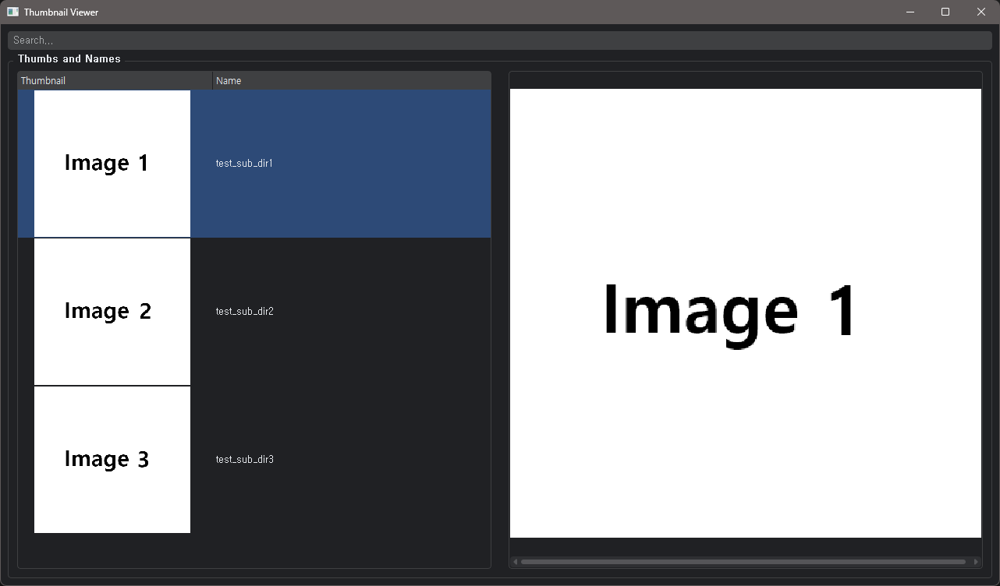

# GUI program Generation. Thumbnail Viewer

  

* ChatGPT 3.5 50%

  

  * Generate GUI code

  

* Me 50%

  

  * searching image files, listing files and directories

  

It takes about a day to make the program

* conversations with ChatGPT

* bug correction

* implementation of internal functions.

  

## Running

* Test Directory

```
I:\TEST\TEST_DIR
├─test_sub_dir1
│      test_image1.png
│
├─test_sub_dir2
│      test_image2.jpg
│
└─test_sub_dir3
        test_image3.png
```
* Running

  

The document below is a program instruction manual written by ChatGPT of 90%.

  

## Thumbnail Viewer Program Guide

  

  

Thumbnail Viewer is a simple viewer program that allows you to conveniently manage image thumbnails and preview larger images.

  

  

### 1. Getting Started

  

  

When you run the program, you can set the directory where thumbnails will be generated. This configuration is managed in the `config.txt` file, and you can manually modify it if necessary.

  

  

### 2. Screen Layout

  

  

-  **Search Bar**: A text box where you can search for specific images or directories. As you type keywords, only items containing the keyword will be displayed.

  

  

-  **Thumbnail List Tree**: On the left side, directories and their respective thumbnail images are displayed. Double-clicking on a directory will show its thumbnails in the large image window.

  

  

-  **Image Label Display**: In the middle, the name of the selected directory is displayed, and on the right side, the large thumbnail image of that directory is shown.

  

  

-  **Large Image Window**: This area displays the large thumbnail image of the selected directory.

  

  

### 3. Features

  

  

-  **Double-Click to Change Thumbnail**: Double-click on a thumbnail image, and the file explorer will open, allowing you to select a new image. The selected image will replace the thumbnail, and this change will be saved locally.

  

  

-  **Open Directory**: Double-clicking on the directory name (not the thumbnail image) will open that directory in the file explorer.

  

  

-  **Keyword Search**: Typing a keyword in the search bar filters the displayed directories. The first matching item will be scrolled into view.

  

  

### 4. Exiting the Program

  

  

To exit the program, simply click the close button (X) on the window.

  

  

Now you can effectively manage image thumbnails and easily preview larger images using Thumbnail Viewer!
