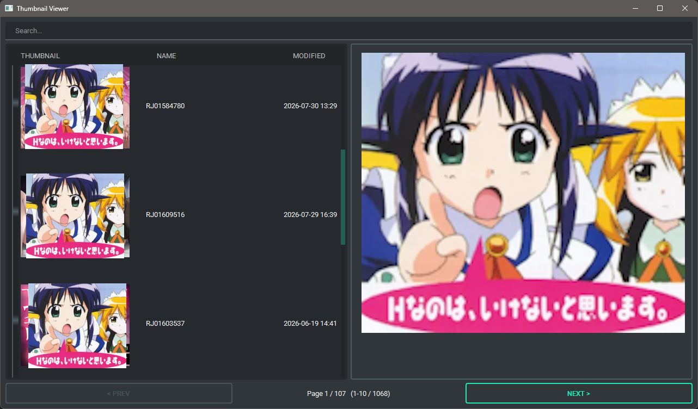

# Thumbnail Viewer

A desktop app for browsing directories with thumbnails.

## Install

### Using the default Python

```bash
pip install uv
uv venv
uv sync
```

### Using a specific Python version

```bash
pip install uv
uv venv --python 3.12
uv sync
```

## Run


```bash
uv run python viewer.py
```

## Configuration

Settings are read from `config.json`, placed next to `viewer.py`:

```json
{
    "search_dir": "Y:/asmr",
    "img_exts": ["png", "jpg", "jpeg", "webp", "bmp"],
    "theme": "dark_teal.xml",
    "default_res": [1280, 720],
    "thumb_size": 200,
    "page_size": 5
}
```

| Key | Description |
|---|---|
| `search_dir` | Root directory to scan for subdirectories |
| `img_exts` | Image file extensions used when searching for a thumbnail |
| `theme` | Any `qt-material` theme name |
| `default_res` | Initial window size, `[width, height]` |
| `thumb_size` | Thumbnail width/height in pixels |
| `page_size` | Number of directories shown per page |

## Preview

  